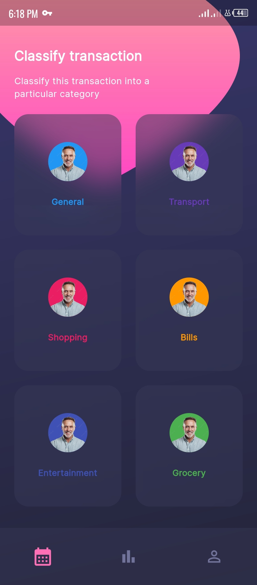

# investmentappui

The transformation of an investment UI design to a real Flutter project.

## Screenshots




## Project Dependencies

```yaml
dependencies:
  flutter:
    sdk: flutter

  fontresoft:
    git:
      url: git@github.com:kenresoft/fontresoft.git
      ref: master
  extensionresoft:
    git:
      url: git@github.com:kenresoft/extensionresoft.git
      ref: master
  cupertino_icons: ^1.0.5
  go_router: ^7.1.1
  flutter_riverpod: ^2.3.6
  awesome_bottom_bar: ^1.2.2
```

## Getting Started

This project is a starting point for a Flutter application.

A few resources to get you started if this is your first Flutter project:

- [Lab: Write your first Flutter app](https://docs.flutter.dev/get-started/codelab)
- [Cookbook: Useful Flutter samples](https://docs.flutter.dev/cookbook)

For help getting started with Flutter development, view the
[online documentation](https://docs.flutter.dev/), which offers tutorials,
samples, guidance on mobile development, and a full API reference.
